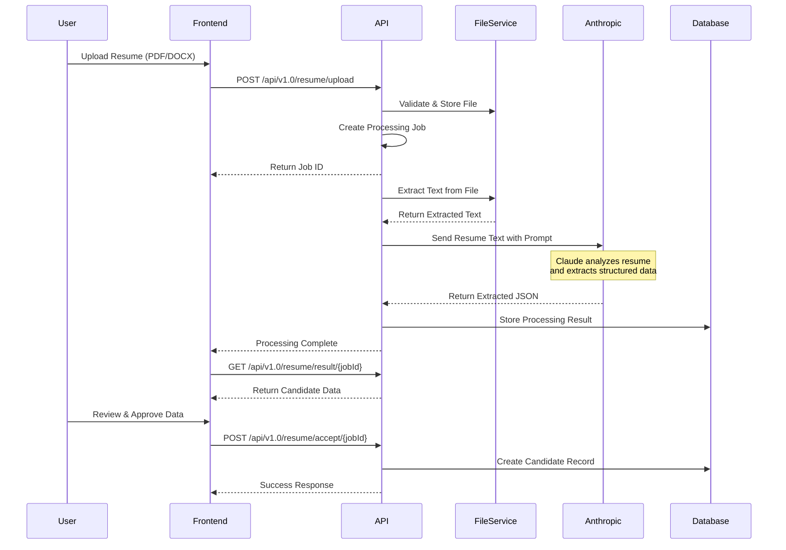

# Product Definition: Candidates Feature

## Executive Summary

The Candidates feature is a comprehensive candidate management system with AI-powered resume processing capabilities. It enables recruiters to efficiently manage candidate profiles, automatically extract information from resumes, and maintain a searchable database of potential hires. The system leverages Anthropic's Claude API for intelligent resume parsing and data extraction.

## Feature Overview

### Core Capabilities
- **Candidate Profile Management**: Create, read, update, and delete candidate records
- **AI-Powered Resume Processing**: Automatic extraction of candidate information from PDF/DOCX files
- **Search & Filter**: Advanced search capabilities across all candidate fields
- **Multi-View Display**: Toggle between table and card views
- **Bulk Operations**: Select and manage multiple candidates simultaneously
- **Data Validation**: Review and approve AI-extracted data before committing

## Technical Architecture

### Frontend Components

#### 1. CandidatesView (`/src/components/views/CandidatesView.tsx`)
- **Purpose**: Main candidate listing and management interface
- **Key Features**:
  - Table/Card view toggle
  - Search bar with real-time filtering
  - Pagination controls
  - Sort by name, email, location, status
  - Bulk selection capabilities
  - Upload resume button

#### 2. CandidateDetailsView (`/src/components/views/CandidateDetailsView.tsx`)
- **Purpose**: Detailed candidate profile display and editing
- **Key Features**:
  - Full candidate information display
  - Edit capabilities for all fields
  - Position history tracking
  - Skills and experience summary
  - Contact information management

#### 3. UploadResumeModal (`/src/components/modals/UploadResumeModal.tsx`)
- **Purpose**: Resume upload and processing interface
- **Key Features**:
  - Drag-and-drop file upload
  - File type validation (PDF/DOCX)
  - Processing status display
  - Error handling and retry capabilities

### Backend API Integration

#### Resume Processing Flow



### API Endpoints

#### 1. Upload Resume
**Endpoint**: `POST /api/v1.0/resume/upload`

**Request**:
```http
POST /api/v1.0/resume/upload
Content-Type: multipart/form-data
X-Tenant-Id: {tenantId}

{
  "file": [binary file data],
  "tenantId": "tenant-123"
}
```

**Response**:
```json
{
  "jobId": "550e8400-e29b-41d4-a716-446655440000",
  "status": "Processing",
  "message": "Resume uploaded successfully and is being processed"
}
```

#### 2. Check Processing Status
**Endpoint**: `GET /api/v1.0/resume/status/{jobId}`

**Response**:
```json
{
  "jobId": "550e8400-e29b-41d4-a716-446655440000",
  "status": "Completed|Processing|Failed",
  "message": "Processing complete",
  "progress": 100,
  "createdAt": "2024-01-20T10:30:00Z",
  "completedAt": "2024-01-20T10:30:45Z"
}
```

#### 3. Get Extracted Data
**Endpoint**: `GET /api/v1.0/resume/result/{jobId}`

**Response**:
```json
{
  "jobId": "550e8400-e29b-41d4-a716-446655440000",
  "candidateData": {
    "firstName": "John",
    "lastName": "Doe",
    "email": "john.doe@example.com",
    "phone": "+1-555-123-4567",
    "location": "San Francisco, CA",
    "profileSummary": "Experienced software engineer with 10 years...",
    "skills": ["JavaScript", "React", "Node.js", "Python"],
    "experience": [
      {
        "company": "Tech Corp",
        "role": "Senior Software Engineer",
        "duration": "2020-2023",
        "description": "Led development of..."
      }
    ],
    "education": [
      {
        "institution": "MIT",
        "degree": "BS Computer Science",
        "year": "2014"
      }
    ]
  },
  "confidence": {
    "overall": 0.92,
    "fields": {
      "name": 0.98,
      "email": 1.0,
      "phone": 0.95,
      "skills": 0.88
    }
  },
  "extractedAt": "2024-01-20T10:30:45Z"
}
```

#### 4. Accept Extracted Data
**Endpoint**: `POST /api/v1.0/resume/accept/{jobId}`

**Request**:
```json
{
  "candidateData": {
    // Optional: Override any extracted fields
    "firstName": "John",
    "lastName": "Doe"
  }
}
```

**Response**:
```json
{
  "success": true,
  "candidateId": "cand-123456",
  "message": "Candidate created successfully"
}
```

### Anthropic Claude Integration

#### Service Configuration
```csharp
// AnthropicAIProvider.cs
public class AnthropicAIProvider : IAIProvider
{
    private const string ANTHROPIC_API_URL = "https://api.anthropic.com/v1/messages";
    private const string MODEL = "claude-3-sonnet-20240229";
    
    public async Task<CandidateData> ExtractFromResumeAsync(string resumeText)
    {
        var prompt = BuildExtractionPrompt(resumeText);
        var response = await SendToAnthropic(prompt);
        return ParseAnthropicResponse(response);
    }
}
```

#### Extraction Prompt Template
Below is a simplified prompt, with the more substantial detail included in resouce [SystemPromptExtraction-Enhanced](./SystemPromptExtraction-Enhanced.txt)

It is suspected that we will need to define a Agent in Anthropic Console with this system prompt to do this more effectively.

```text
You are an expert resume parser. Extract the following information from the resume text below and return it as structured JSON:

Required fields:
- firstName: string
- lastName: string  
- email: string
- phone: string (include country code if present)
- location: string (city, state/country)
- profileSummary: string (2-3 sentence summary)
- skills: string[] (technical and soft skills)
- experience: array of {company, role, duration, description}
- education: array of {institution, degree, year}

Respond ONLY with valid JSON. If a field cannot be determined, use null.

Resume text:
{resumeText}
```

#### API Request to Anthropic
```json
{
  "model": "claude-3-sonnet-20240229",
  "max_tokens": 4096,
  "messages": [
    {
      "role": "user",
      "content": "{extraction prompt with resume text}"
    }
  ],
  "temperature": 0.2,
  "system": "You are a precise resume data extraction assistant. Extract information accurately and format as JSON."
}
```

### Data Models

#### Candidate Entity
```typescript
interface Candidate {
  id: string;
  firstName: string;
  lastName: string;
  email: string;
  phone: string;
  location: string;
  status: 'active' | 'inactive' | 'placed';
  profileSummary: string;
  skills: string[];
  experience: Experience[];
  education: Education[];
  positions: Position[];
  createdAt: Date;
  updatedAt: Date;
  resumeFileUrl?: string;
  linkedInUrl?: string;
  availability?: string;
  desiredSalary?: number;
  notes?: string;
}

interface Experience {
  company: string;
  role: string;
  duration: string;
  description: string;
  current: boolean;
}

interface Education {
  institution: string;
  degree: string;
  field: string;
  year: string;
  gpa?: number;
}
```

## Security & Compliance

### Data Protection
1. **PII Handling**: All candidate data is encrypted at rest and in transit
2. **File Storage**: Uploaded resumes stored in secure, tenant-isolated directories
3. **API Security**: All endpoints require authentication and tenant validation
4. **Audit Trail**: All data modifications are logged with user and timestamp

### Anthropic API Security
1. **API Key Management**: Stored in secure secrets management (never in code)
2. **Request Sanitization**: Resume text cleaned before sending to Anthropic
3. **Response Validation**: AI responses validated before storage
4. **Rate Limiting**: Implements retry logic with exponential backoff

## Performance Specifications

### Processing Times
- **File Upload**: < 2 seconds for files up to 10MB
- **Text Extraction**: < 1 second for PDF/DOCX
- **AI Processing**: 5-15 seconds (Anthropic API call)
- **Total End-to-End**: < 20 seconds typical

### Scalability
- **Concurrent Processing**: Supports 10 simultaneous resume uploads per tenant
- **Background Processing**: Async job queue prevents UI blocking
- **Database Optimization**: Indexed on key search fields (name, email, skills)

### Limits
- **File Size**: Maximum 10MB per resume
- **File Types**: PDF, DOCX only
- **Processing Timeout**: 30 seconds
- **Retry Attempts**: 3 attempts with exponential backoff

## User Experience

### Success Metrics
1. **Resume Processing Success Rate**: > 95%
2. **Data Extraction Accuracy**: > 90% for standard fields
3. **User Acceptance Rate**: > 80% of extracted data accepted without modification
4. **Processing Time**: 90% of resumes processed within 20 seconds

### Error Handling
1. **File Validation Errors**: Clear messages for unsupported formats or size
2. **Processing Failures**: Automatic retry with user notification
3. **Partial Extraction**: Allow users to manually complete missing fields
4. **Network Errors**: Graceful degradation with offline indication

## Future Enhancements

### Phase 2 Features
1. **Bulk Resume Upload**: Process multiple resumes simultaneously
2. **LinkedIn Integration**: Import profiles directly from LinkedIn
3. **Duplicate Detection**: Identify existing candidates before creating new records
4. **Smart Matching**: AI-powered candidate-to-job matching

### Phase 3 Features
1. **Resume Parsing Templates**: Custom extraction rules per client
2. **Multi-language Support**: Process resumes in multiple languages
3. **Advanced Analytics**: Candidate pipeline and sourcing metrics
4. **Email Integration**: Parse resumes from email attachments

## Configuration Options

### Tenant-Level Settings
```json
{
  "candidates": {
    "enableResumeProcessing": true,
    "maxFileSize": 10485760,
    "allowedFileTypes": ["pdf", "docx"],
    "aiProvider": "anthropic",
    "autoApproveHighConfidence": false,
    "confidenceThreshold": 0.85,
    "duplicateCheckEnabled": true,
    "customFields": []
  }
}
```

### Feature Flags
- `CANDIDATES`: Enable entire candidates module
- `CANDIDATES_AI_PROCESSING`: Enable AI resume processing
- `CANDIDATES_BULK_UPLOAD`: Enable bulk operations
- `CANDIDATES_ADVANCED_SEARCH`: Enable advanced search filters

## Support & Monitoring

### Logging
- All API calls logged with request/response details
- Processing job lifecycle tracked
- Error details captured for troubleshooting
- Performance metrics collected

### Health Checks
- Anthropic API connectivity test
- File storage availability
- Database connection status
- Background job processor status

### Metrics Dashboard
- Daily processing volume
- Success/failure rates
- Average processing time
- API usage and costs
- User engagement metrics